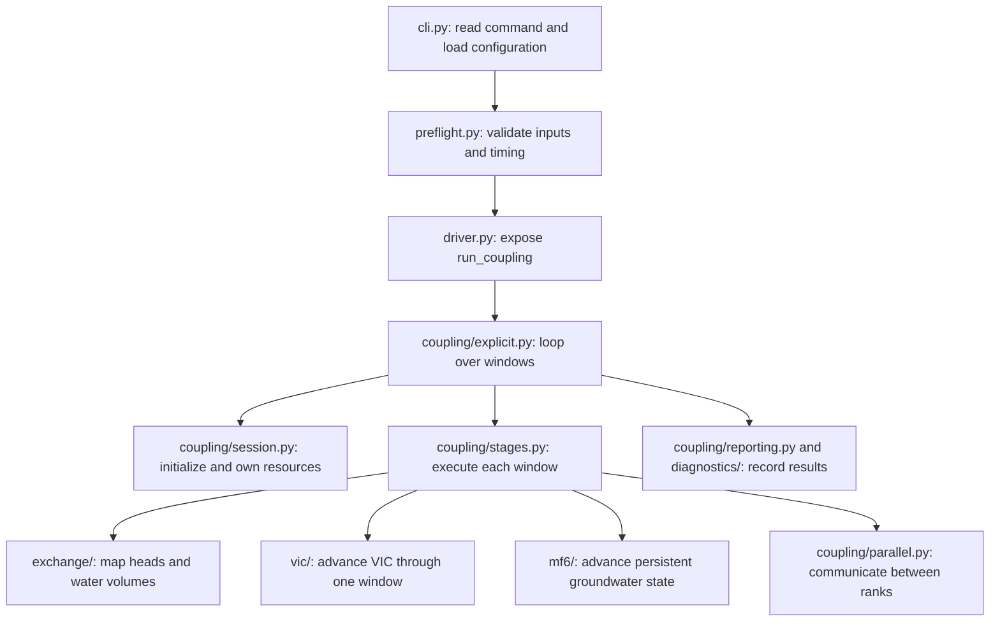

# Python architecture: what each file does

The framework implements one explicit coupling scheme. VIC receives groundwater
heads at the start of a window, runs once, and returns an accumulated exchange
amount. Persistent MODFLOW models then advance through that same window under a
constant exchange rate. The next window uses their updated heads.

Start with [`coupling/explicit.py`](../src/vicmf6/coupling/explicit.py). Its loop
contains the complete scientific sequence. Follow a stage into
[`coupling/stages.py`](../src/vicmf6/coupling/stages.py) when you want its equations
and conservation checks; you do not need to read MPI buffer packing or plotting
to understand that sequence.

This guide covers every Python file under `src/vicmf6/`, including package
entry points. For installation and commands to run tests, examples, or your own
models, use [`run-abd.md`](../run-abd.md).

- [Overall layout and execution](#overall-layout-and-execution)
- [Find the module for a question](#where-each-responsibility-lives)
- [File-by-file guide](#file-by-file-guide)
- [Water transfer through one window](#follow-the-water-through-one-window)
- [MPI ownership and failure handling](#mpi-ownership-and-failure-handling)
- [Scaling and remaining limits](#scaling-changes-and-remaining-limits)
- [Where to make extensions](#make-an-extension-in-the-owning-module)
- [Verification](#verification)

## Overall layout and execution

There are three workflows: build the overlap geometry before a run, execute
the coupled models, and analyze their saved results afterward. The coupling
loop uses the prepared overlap table; polygon intersection and plotting happen
outside that loop.

```text
src/vicmf6/
├── bootstrap.py, cli.py          Command startup and command selection
├── driver.py                    Public entry point for coupled execution
├── preflight.py, inspection.py   Static checks and readable input summary
├── schedule.py                  Coupling windows and VIC record counts
├── mpi_spawn.py, netcdf.py       VIC launch and shared NetCDF reading rules
├── errors.py, __init__.py        Named errors and package exports
├── config/                      Validated settings from YAML and model inputs
├── model_inputs/                Read existing VIC and MF6 input metadata
├── coupling/                    Explicit sequence, MPI ownership, reporting
├── exchange/                    Grid mapping and transfer conservation
├── vic/                         Prepare, run, and read each VIC window
├── mf6/                         Keep MF6 alive and advance its native timesteps
├── diagnostics/                 Logs and records written during execution
├── preprocess/exchange_builder/ Build the overlap CSV from grid geometry
└── postprocess/
    ├── loaders/                 Read completed-run files
    ├── metrics/                 Calculate report quantities from those files
    └── figures/                 Plot the calculated quantities
```

For `vicmf6 run`, command handling leads into a small scientific loop:



The arrows show calls and responsibilities, not additional processes. The
session is initialized once before the loop and finalized after all windows
succeed. The numbered sequence below explains the order within each window.

Several file names repeat because each package has its own responsibility:

| Name | Meaning in this project |
| --- | --- |
| `__init__.py` | Defines a Python package's public imports. Private helpers stay in their owning modules, where their callers and tests import them directly. |
| `records.py` | Defines named bundles of values passed between functions, such as a configuration or window result. These records do not own native model processes. |
| `runtime.py` | Owns access to a running model and its lifecycle: preparing or initializing it, advancing it, and accepting results or finalizing it. |
| `loading.py` or `loaders/` | Reads a file and turns its contents into values the rest of the program can use. |
| `validation.py` | Checks whether those values satisfy the input contract before calculations depend on them. |
| `metrics/` | Calculates report quantities from saved outputs, such as cumulative exchange or groundwater budget closure. |

For example, `vic/runtime.py` manages VIC windows, while `mf6/runtime.py`
manages a persistent groundwater model. They use different native interfaces
and have different lifetimes. Similarly, `diagnostics/` writes evidence during
execution; `postprocess/` later reads that evidence together with native model outputs.

## Where each responsibility lives

| Question | Module to read or change |
| --- | --- |
| What happens during one coupling window? | `coupling/explicit.py`, `coupling/stages.py` |
| Which rank owns a model, its files, and its lifetime? | `coupling/session.py` |
| What crosses MPI, and which reduction applies? | `coupling/parallel.py` |
| How are accepted results reported? | `coupling/reporting.py`, `diagnostics/` |
| How does YAML become a validated configuration? | `config/loading.py`, `config/validation.py`, `config/records.py` |
| Where do model calendars and package names come from? | `model_inputs/vic_global.py`, `model_inputs/mf6_simulation.py`, `model_inputs/mf6_time.py` |
| How is geometry checked and used to exchange water? | `exchange/loading.py`, `exchange/table.py`, `exchange/conservation.py` |
| How are VIC restarts and global files prepared? | `vic/runtime.py`, `vic/global_file.py`, `vic/restart_files.py` |
| How is VIC launched? | `mpi_spawn.py` |
| How does MF6 initialize and retain state? | `mf6/runtime.py` |
| What happens inside an MF6 substep? | `mf6/advance.py`, `mf6/time_steps.py` |
| What do API package arrays mean? | `mf6/boundary.py`, `mf6/variables.py` |
| How are native lateral flows interpreted? | `mf6/native_flow.py`, `mf6/lateral_flow.py` |
| How are missing VIC values handled? | `netcdf.py` |
| How is an overlap CSV generated offline? | `preprocess/exchange_builder/` |
| How are saved outputs loaded, analyzed, and plotted? | `postprocess/loaders/`, `postprocess/metrics/`, `postprocess/figures/` |
| Where are output columns and acceptance rules defined? | `postprocess/table_schema.py`, `postprocess/acceptance.py` |

Files are grouped by responsibility, with plain functions for calculations and
small objects for resources that have a lifetime. `Mf6Runtime` owns an
`ApiFluxBoundary`, a `NativeLateralFlow` reader, and a `TdisSchedule`. There is no
plugin registry, inheritance hierarchy, or second configuration layer to learn.
The original public imports, such as `from vicmf6.mf6 import Mf6Runtime`, still
work through package exports. `driver.py` retains the execution entry point.

Package exports do not mirror every implementation function. For example,
`from vicmf6.mf6 import Mf6Runtime` is a public entry point; a test of native
timestep selection imports `TdisSchedule` from `vicmf6.mf6.time_steps` directly.
Runtime objects take a standard `logging.Logger` and call its methods directly.
To silence output, configure the logger's level rather than passing a placeholder
object that discards messages.

Record definitions use `records.py`, and logger setup uses `log_setup.py`.
Avoid standard-library module names such as `types.py` and `logging.py`: editors
and other Python tools can search the current directory during startup, even
when no framework command is being run. Package-qualified legacy imports are
retained as aliases, without conflicting files on disk.

## File-by-file guide

Paths in the following tables are relative to `src/vicmf6/`. Each filename is a
link to its implementation. Start with the top-level entry points and
`coupling/`; use the other tables when you follow a call into a package.

### Command entry points and shared utilities

| File | What it does and how it connects |
| --- | --- |
| [__init__.py](../src/vicmf6/__init__.py) | Defines the package version and exposes `ExchangeTable` and `SignedVolume` when requested. Importing the package alone does not start a model. |
| [bootstrap.py](../src/vicmf6/bootstrap.py) | Entry point used by the installed `vicmf6` command. Replaces the process with the same Python interpreter running `cli.py` with `-E`, ignoring inherited Python environment overrides. Also defines thread defaults applied by the CLI before numerical libraries load. |
| [cli.py](../src/vicmf6/cli.py) | Defines arguments and routes `version`, `inspect`, `preflight`, `run`, and `post`. For a run, loads settings, checks inputs, reserves fresh outputs, sets up logging, and calls the driver. Handles runtime failures with MPI abort. |
| [driver.py](../src/vicmf6/driver.py) | Re-exports `run_coupling` from `coupling/explicit.py`. Keeps the established import path available; the actual algorithm lives in `explicit.py`. |
| [preflight.py](../src/vicmf6/preflight.py) | Checks the overlap table, model identities, required head metadata, and whether coupling boundaries fit VIC and MF6 timing. Returns a summary without advancing either model. |
| [inspection.py](../src/vicmf6/inspection.py) | Formats the configuration and preflight summary for `vicmf6 inspect`, including model calendars, mapping counts, and MPI requirements. |
| [schedule.py](../src/vicmf6/schedule.py) | Defines `CouplingWindow`, builds the sequence of exchange intervals, and converts a duration into an exact number of VIC records. MF6 substeps are handled separately in `mf6/time_steps.py`. |
| [mpi_spawn.py](../src/vicmf6/mpi_spawn.py) | Launches VIC child ranks from the controller, sets their environment and thread limits, and waits for communicator disconnection. Contains the spawn timeout handling; the C helper supplies the child's matching disconnect. |
| [netcdf.py](../src/vicmf6/netcdf.py) | Converts NetCDF masks and fill values to NaN and sums VIC records without treating missing data as zero. Shared by runtime and postprocessing readers. |
| [errors.py](../src/vicmf6/errors.py) | Defines named exception classes for configuration, mapping, conservation, VIC, MF6, coupling, and postprocessing failures. Callers raise these with context; command handling reports them. |
| [surface_runoff.py](../src/vicmf6/surface_runoff.py) | Compatibility imports for the optional runoff feature. Mapping lives in `exchange/runoff.py`; native SFR access lives in `mf6/boundary.py`. |

Two command-launch paths reach the same CLI: the installed `vicmf6` command
uses `bootstrap.py`, while the repository's [`./vicmf6`](../vicmf6) shell script
selects Python, adds this checkout's `src/` directory, and runs `vicmf6.cli`
directly. [`pyproject.toml`](../pyproject.toml) declares the installed entry point,
package dependencies, and optional dependency groups. Each CLI process sets missing
OpenMP/BLAS thread limits to one before scientific imports, preserving explicit
shell settings. `vic.omp_threads` applies separately to spawned VIC ranks.

### `config/`: turn settings into a run contract

Configuration loading combines the YAML with metadata from the original model
inputs. The resulting `ApplicationConfig` describes the run before native
models are initialized.

| File | What it does and how it connects |
| --- | --- |
| [config/__init__.py](../src/vicmf6/config/__init__.py) | Exposes configuration records, `load_config`, output-directory reservation, and provenance serialization. Keeps established package imports available. |
| [config/records.py](../src/vicmf6/config/records.py) | Defines `ApplicationConfig`, `VicConfig`, `Mf6Config`, `CouplingConfig`, and `DiagnosticsConfig`. Holds resolved paths and settings shared by the other packages. |
| [config/loading.py](../src/vicmf6/config/loading.py) | Implements `load_config`: reads YAML, resolves paths, asks `model_inputs/` for native metadata, validates values, and constructs the configuration records. |
| [config/validation.py](../src/vicmf6/config/validation.py) | Checks types, required fields, finite tolerances, positive counts, paths, and relationships between settings. Resolves paths relative to the configuration file. |
| [config/directories.py](../src/vicmf6/config/directories.py) | Exclusively creates the coupler-owned output directories before logs or models start. Rejects existing output locations so a new launch cannot silently overwrite them. |
| [config/provenance.py](../src/vicmf6/config/provenance.py) | Converts the resolved configuration to JSON-safe values for the run manifest, allowing outputs to be traced back to their settings. |

### `model_inputs/`: discover what the models already specify

These files read calendars, model names, and file references from existing
input decks. For example, `model_inputs/vic_global.py` reads the original VIC
global file; `vic/global_file.py` later writes a derived file for one window.

| File | What it does and how it connects |
| --- | --- |
| [model_inputs/__init__.py](../src/vicmf6/model_inputs/__init__.py) | Exposes metadata records and the VIC/MF6 parsers used by configuration loading. |
| [model_inputs/records.py](../src/vicmf6/model_inputs/records.py) | Defines VIC output-stream and calendar metadata, MF6 model identifiers, stress periods, and simulation metadata. Also expands period settings into their native timestep sequence. |
| [model_inputs/vic_global.py](../src/vicmf6/model_inputs/vic_global.py) | Reads VIC dates, native step length, file references, and output declarations. Identifies the stream containing groundwater exchange. |
| [model_inputs/mf6_simulation.py](../src/vicmf6/model_inputs/mf6_simulation.py) | Reads `mfsim.nam` and model name files to discover GWF models, API packages, solution groups, and the TDIS file. |
| [model_inputs/mf6_time.py](../src/vicmf6/model_inputs/mf6_time.py) | Parses TDIS time units and stress-period settings. Requires day units, matching the framework's rate convention. |
| [model_inputs/text.py](../src/vicmf6/model_inputs/text.py) | Supplies shared text-parsing helpers for comments, integer values, and paths relative to the declaring model file. |

### `coupling/`: coordinate one explicit scheme

This package joins the model adapters and exchange calculations. Read
`explicit.py` first, then `stages.py`; resource ownership and communication have
their own files so they do not obscure the scientific sequence.

| File | What it does and how it connects |
| --- | --- |
| [coupling/__init__.py](../src/vicmf6/coupling/__init__.py) | Marks the orchestration package and retains the legacy qualified import for its records. |
| [coupling/explicit.py](../src/vicmf6/coupling/explicit.py) | Implements `run_coupling`: initializes the session, builds windows, calls the physical stages in order, records results, and finalizes a successful run. |
| [coupling/stages.py](../src/vicmf6/coupling/stages.py) | Implements head mapping, VIC execution, exchange mapping and conservation checks, and groundwater advancement with applied-flow checks. Uses `exchange/`, the model adapters, and `parallel.py`. |
| [coupling/session.py](../src/vicmf6/coupling/session.py) | Defines `CouplingSession`, the owner of rank-specific resources. Assigns workers to models, distributes overlap rows, initializes adapters, tracks VIC restart state, and caches the head-map denominator. |
| [coupling/parallel.py](../src/vicmf6/coupling/parallel.py) | Defines `CouplingCommunicator`: broadcasts VIC exchange, reduces head contributions and diagnostics, and synchronizes ranks before groundwater solves. Specifies which quantities use SUM, MIN, or MAX. |
| [coupling/records.py](../src/vicmf6/coupling/records.py) | Defines values exchanged between stages: `WindowTimings`, `SurfaceExchange`, `BoundaryExchange`, and `GroundwaterStatistics`. Separates worker-local values from controller totals. |
| [coupling/reporting.py](../src/vicmf6/coupling/reporting.py) | Converts accepted stage results and timings into a diagnostic record and progress messages. Delegates persistent output to `diagnostics/`. |

### `exchange/`: transfer quantities between different grids

The overlap table says which VIC cells overlap which MF6 nodes and by how much
area. This package uses those fixed weights to transfer values; it does not
launch models or construct polygons.

| File | What it does and how it connects |
| --- | --- |
| [exchange/__init__.py](../src/vicmf6/exchange/__init__.py) | Exposes `ExchangeTable`, named transfer records, and conservation-check functions. |
| [exchange/records.py](../src/vicmf6/exchange/records.py) | Defines `VicCell` identities, `HeadContribution` weighted sums, `MappingResult` overlap/node volumes, and `SignedVolume` positive, negative, and net totals. |
| [exchange/loading.py](../src/vicmf6/exchange/loading.py) | Reads overlap CSV columns and checks the complete set of records, including coverage. Supplies validated geometry to `ExchangeTable`. |
| [exchange/validation.py](../src/vicmf6/exchange/validation.py) | Checks individual rows, cell identities, finite areas and runtime vectors, duplicate relations, and conflicting VIC metadata. |
| [exchange/table.py](../src/vicmf6/exchange/table.py) | Implements `ExchangeTable`: selects coupled VIC values, converts exchange depth to overlap/node volumes, maps heads back with area weights, and creates worker-specific table partitions. |
| [exchange/conservation.py](../src/vicmf6/exchange/conservation.py) | Compares signed or net volumes using the configured tolerances. Signed checks detect cancelling errors; net checks allow legitimate cancellation when overlaps merge onto a node. |
| [exchange/runoff.py](../src/vicmf6/exchange/runoff.py) | Validates VIC-to-SFR reach weights and maps VIC runoff depths to reach volumes. Contains no native model access. |

### `vic/`: run a restart-linked VIC window

`VicRuntime` lives on the controller. Each window gets a new VIC child launch;
the accepted restart file carries VIC state into the next window.

| File | What it does and how it connects |
| --- | --- |
| [vic/__init__.py](../src/vicmf6/vic/__init__.py) | Exposes `VicRuntime` and its window records while preserving existing imports. |
| [vic/records.py](../src/vicmf6/vic/records.py) | Defines `PreparedVicWindow` for files and launch settings, and `VicWindowResult` for accumulated exchange, water-error diagnostics, and the accepted restart. |
| [vic/runtime.py](../src/vicmf6/vic/runtime.py) | Coordinates `prepare_window` and `run_window`: prepares inputs, calls `mpi_spawn.py`, reads output, and requires the expected fresh restart before accepting a window. |
| [vic/global_file.py](../src/vicmf6/vic/global_file.py) | Renders a window-specific global file from the original template. Replaces coupler-owned timing, state, boundary, and output directives while retaining model physics and forcing settings. |
| [vic/restart_files.py](../src/vicmf6/vic/restart_files.py) | Writes mapped groundwater heads to VIC's boundary text file and constructs the expected timestamped restart paths. |
| [vic/outputs.py](../src/vicmf6/vic/outputs.py) | Owns `read_vic_window_outputs`, shared by runtime and postprocessing. Reads exchange, water error, and optional runoff; uses `netcdf.py` so missing records remain missing during temporal accumulation. |

### `mf6/`: advance persistent groundwater models

Each groundwater worker owns an `Mf6Runtime`. It uses `xmipy` to call the native
MF6 library and retains groundwater state across all coupling windows.
`Mf6Runtime` contains an `ApiFluxBoundary`, a `NativeLateralFlow` reader, and a
`TdisSchedule`; these small objects divide its responsibilities.

| File | What it does and how it connects |
| --- | --- |
| [mf6/__init__.py](../src/vicmf6/mf6/__init__.py) | Exposes `Mf6Runtime`, result records, API sign conversion, and internal-flow diagnostics through the existing package interface. |
| [mf6/records.py](../src/vicmf6/mf6/records.py) | Defines `Mf6AdvanceResult` with updated heads, requested/applied volumes, API error, and iteration count, plus `LateralFlowDiagnostics` for integrated internal flows. |
| [mf6/runtime.py](../src/vicmf6/mf6/runtime.py) | Initializes MF6 once on the worker communicator, provides current heads and time, owns the boundary/flow/schedule objects, delegates advancement, and finalizes after successful completion. |
| [mf6/advance.py](../src/vicmf6/mf6/advance.py) | Converts window volume to a fixed rate, advances native substeps, enforces solve convergence, reads actual flows after `finalize_solve`, checks API application, and integrates rates into volumes. |
| [mf6/boundary.py](../src/vicmf6/mf6/boundary.py) | Implements `ApiFluxBoundary` and optional `SfrRunoffBoundary`. Checks capacity, writes API fluxes with `RHS = -Q`, and reads converged `SIMVALS`. The SFR adapter writes `RUNOFF` and reads actual `SIMRUNOFF`, so dropped runoff cannot pass as applied. |
| [mf6/nodes.py](../src/vicmf6/mf6/nodes.py) | Translates one-based input-grid node IDs to compact native solver IDs using `NODESUSER`, `NODES`, and `NODEUSER`. Rejects coupling to inactive/pass-through cells. Extra package unknowns in `X` are not grid heads. |
| [mf6/time_steps.py](../src/vicmf6/mf6/time_steps.py) | Implements `TdisSchedule`. Validates the original MF6 timestep boundaries once and finds the next native step without changing the model's time discretization. |
| [mf6/variables.py](../src/vicmf6/mf6/variables.py) | Resolves named MF6 variables to XMI addresses used to access native arrays. Required variables fail with context; optional diagnostic variables may be unavailable. |
| [mf6/native_flow.py](../src/vicmf6/mf6/native_flow.py) | Implements `NativeLateralFlow`. Finds live `FLOWJA` rates and copies fixed `IA`/`JA` connectivity so connections can be interpreted after each solve. Disables this optional diagnostic when topology is unavailable. |
| [mf6/lateral_flow.py](../src/vicmf6/mf6/lateral_flow.py) | Calculates internal-flow accounting from supplied connectivity and integrated flows: net volume per node, domain cancellation, gross pair transfer, and mismatch between opposite directions. Does not access the native library itself. |

Here, **`SIMVALS`** contains actual API boundary rates between the coupling and
groundwater, one value per boundary entry. **`FLOWJA`** contains groundwater
connection rates; its saved budget record is called **`FLOW-JA-FACE`**.
`IA`/`JA` identify which entries belong to which connected cells. Off-diagonal
rates are positive into the row cell; diagonal entries are cell balance
residuals and are skipped by the internal-transfer calculations. Despite the
file name `lateral_flow.py`, these diagnostics include available vertical
connections as well as horizontal ones.

Exchange tables and public head arrays retain full input-grid numbering. Only
the native adapter translates API `NODELIST` to solver numbering; it expands
returned heads to the full grid, with NaN at inactive/pass-through cells.
Head statistics exclude those cells. Numerical solution IDs come from the
order of `IMS6`/`EMS6` entries, not the enclosing `SOLUTIONGROUP` number.

Both kinds of rates use m³/day in this framework. `advance.py` multiplies by
each native timestep's duration in days before accumulating m³. Thus,
`boundary.py` checks the external interface, while `native_flow.py` and
`lateral_flow.py` supply diagnostics of redistribution inside groundwater.

### `diagnostics/`: record evidence during the run

| File | What it does and how it connects |
| --- | --- |
| [diagnostics/__init__.py](../src/vicmf6/diagnostics/__init__.py) | Exposes logger setup, the window diagnostic record, and `DiagnosticsWriter`. Preserves the legacy qualified logging import. |
| [diagnostics/records.py](../src/vicmf6/diagnostics/records.py) | Defines `WindowDiagnostics` and its construction helper: the common fields for one accepted window's scientific quantities and timings. |
| [diagnostics/log_setup.py](../src/vicmf6/diagnostics/log_setup.py) | Creates per-rank logs and controller progress output, according to verbosity and logging settings. Uses directories already reserved by the CLI. |
| [diagnostics/writer.py](../src/vicmf6/diagnostics/writer.py) | Writes the controller-owned `run_manifest.json`, `coupling_windows.csv`, and `run_summary.json`. Aggregates accepted-window totals without making workers append to shared files. |

### `preprocess/exchange_builder/`: prepare spatial coupling offline

This workflow reads model geometry, intersects it in a common projected
coordinate system, and writes the overlap CSV consumed by `exchange/`.
Geospatial dependencies are needed here, before the time loop.

| File | What it does and how it connects |
| --- | --- |
| [preprocess/__init__.py](../src/vicmf6/preprocess/__init__.py) | Marks the package containing offline preprocessing utilities. |
| [preprocess/exchange_builder/__init__.py](../src/vicmf6/preprocess/exchange_builder/__init__.py) | Exposes the builder, geometry readers, result records, summary formatter, and command entry point. |
| [preprocess/exchange_builder/__main__.py](../src/vicmf6/preprocess/exchange_builder/__main__.py) | Calls the builder CLI when launched with `python -m vicmf6.preprocess.exchange_builder`. |
| [preprocess/exchange_builder/cli.py](../src/vicmf6/preprocess/exchange_builder/cli.py) | Parses preprocessing arguments, calls `build_exchange_table`, and prints the resulting summary. This is separate from the simulation CLI. |
| [preprocess/exchange_builder/records.py](../src/vicmf6/preprocess/exchange_builder/records.py) | Defines VIC and MF6 source-cell geometry records, `BuildArtifacts` output locations, and `ExchangeBuildError`. |
| [preprocess/exchange_builder/dependencies.py](../src/vicmf6/preprocess/exchange_builder/dependencies.py) | Loads optional geometry and model-reading libraries when preprocessing is requested and explains missing dependencies. |
| [preprocess/exchange_builder/vic_geometry.py](../src/vicmf6/preprocess/exchange_builder/vic_geometry.py) | Reads VIC domain/parameter geometry, checks rectilinear coordinates and active masks, and builds cell polygons while retaining row/column identities. |
| [preprocess/exchange_builder/mf6_geometry.py](../src/vicmf6/preprocess/exchange_builder/mf6_geometry.py) | Reads DIS, DISV, or DISU geometry, chooses coupled surface nodes, and extracts their polygons and vertical bounds. Retains one-based MF6 node numbers for the CSV. |
| [preprocess/exchange_builder/intersections.py](../src/vicmf6/preprocess/exchange_builder/intersections.py) | Implements `build_exchange_table`: coordinates geometry loading, intersects cells, calculates overlap areas, checks coverage, and writes the CSV and summary artifacts. |
| [preprocess/exchange_builder/summary.py](../src/vicmf6/preprocess/exchange_builder/summary.py) | Computes spacing and coverage statistics and formats the human-readable geometry summary. |

### `postprocess/`: coordinate completed-run analysis

The Python package is `vicmf6.postprocess`, matching `vicmf6.preprocess`.
The command remains `vicmf6 post`, and the installation extra remains
`vicmf6[post]`; these names select a command and dependencies, respectively.

The postprocessor reads the run's saved evidence without advancing either
model. Its general path is `runner.py` → loaders → metrics → acceptance and
reporting, with figures added for `post figures` or `post all`.

| File | What it does and how it connects |
| --- | --- |
| [postprocess/__init__.py](../src/vicmf6/postprocess/__init__.py) | Exposes `run_postprocessing`, called by the main CLI's `post` commands. |
| [postprocess/runner.py](../src/vicmf6/postprocess/runner.py) | Coordinates reading outputs, calculating the standard tables, evaluating acceptance, writing summaries/reports, and optionally making figures. Returns failure when numerical acceptance fails. |
| [postprocess/records.py](../src/vicmf6/postprocess/records.py) | Defines postprocessing paths, head time series, cell geometry, and individual/aggregate acceptance results. |
| [postprocess/acceptance.py](../src/vicmf6/postprocess/acceptance.py) | Applies numerical acceptance rules to window conservation, cumulative exchange, groundwater mass balance, and available internal-flow/cell-budget evidence. Produces named checks with pass/fail results. |
| [postprocess/report.py](../src/vicmf6/postprocess/report.py) | Creates postprocessing directories and writes CSV, JSON, acceptance text, and the Markdown report from the calculated results. |
| [postprocess/stored_rows.py](../src/vicmf6/postprocess/stored_rows.py) | Stores large intermediate row tables in private temporary files and supports repeated streaming reads for summaries, CSV export, and figures. The runner closes files and removes the temporary directory on success or failure. |
| [postprocess/table_schema.py](../src/vicmf6/postprocess/table_schema.py) | Defines stable column order for exported tables, including optional tables with no rows. This is part of the output interface. |

### `postprocess/loaders/`: read saved evidence

These readers locate files and translate their formats into arrays and records.
They supply the metrics package with the saved values needed for calculations.

| File | What it does and how it connects |
| --- | --- |
| [postprocess/loaders/__init__.py](../src/vicmf6/postprocess/loaders/__init__.py) | Exposes the completed-run readers through one import surface used by `postprocess/runner.py`. |
| [postprocess/loaders/tables.py](../src/vicmf6/postprocess/loaders/tables.py) | Reads coupling-window CSV rows, JSON metadata, and overlap records; rebuilds the validated exchange-table object for analysis. |
| [postprocess/loaders/vic_outputs.py](../src/vicmf6/postprocess/loaders/vic_outputs.py) | Loads saved VIC NetCDF fields and reconstructs exchange totals for each coupling window using the shared missing-data rules. |
| [postprocess/loaders/mf6_metadata.py](../src/vicmf6/postprocess/loaders/mf6_metadata.py) | Loads the MF6 input deck with FloPy and supplies shared helpers to find output paths, native timestep lengths, and grid/property arrays. Resolves each model's own binary grid from its discretization package, including `GRB6 FILEOUT` and `NOGRB`. |
| [postprocess/loaders/mf6_heads.py](../src/vicmf6/postprocess/loaders/mf6_heads.py) | Indexes saved head times and reads one head record when requested. `Mf6HeadSeries.read_heads(index)` includes the initial condition at index zero; the runner owns the reader lifetime. |
| [postprocess/loaders/mf6_geometry.py](../src/vicmf6/postprocess/loaders/mf6_geometry.py) | Collects cell areas, elevations, storage metadata, and plotting geometry. When coordinates are absent, uses overlap-weighted VIC centroids for that model, labeled as such, or reports coordinates unavailable. Never reads adjacent archived geometry. |
| [postprocess/loaders/mf6_budgets.py](../src/vicmf6/postprocess/loaders/mf6_budgets.py) | Reads cell-by-cell budgets one native record at a time, keeps aggregate package totals, and rereads API rates only for the requested coupling window. Records missing evidence explicitly. |
| [postprocess/loaders/mf6_connections.py](../src/vicmf6/postprocess/loaders/mf6_connections.py) | Reads saved `FLOW-JA-FACE` values and grid connectivity to reconstruct cell and paired-connection transfers. This is the file-based counterpart of runtime internal-flow reading. |

### `postprocess/metrics/`: calculate quantities for the report

| File | What it does and how it connects |
| --- | --- |
| [postprocess/metrics/__init__.py](../src/vicmf6/postprocess/metrics/__init__.py) | Exposes the table-building and summary functions used by the postprocessing runner. |
| [postprocess/metrics/mapping.py](../src/vicmf6/postprocess/metrics/mapping.py) | Builds VIC cell identity and VIC/MF6 overlap-coverage tables from the fixed geometry. |
| [postprocess/metrics/exchange.py](../src/vicmf6/postprocess/metrics/exchange.py) | Reconstructs VIC signed volumes and MF6 node targets; compares those targets with saved API application over matching coupling intervals. |
| [postprocess/metrics/groundwater.py](../src/vicmf6/postprocess/metrics/groundwater.py) | Builds head trajectories, head-change statistics, budget-term and internal-flow tables. Evaluates connected confined-cell closure when the necessary storage metadata are available. |
| [postprocess/metrics/mass_balance.py](../src/vicmf6/postprocess/metrics/mass_balance.py) | Combines MF6 storage and external budget terms into per-model and domain mass-balance totals. Converts the MF6 storage-budget sign to physical storage change and adds summary quantities. |
| [postprocess/metrics/time_series.py](../src/vicmf6/postprocess/metrics/time_series.py) | Supplies shared time alignment, interval duration, exchange-direction labeling, and signed aggregation helpers. |
| [postprocess/metrics/summary.py](../src/vicmf6/postprocess/metrics/summary.py) | Assembles headline run statistics and error measures from the reconstructed tables for acceptance and reporting. |

The groundwater budget check includes MF6 storage and its other external
stresses. It is distinct from the runtime check that the VIC–MF6 interface
transfer was applied correctly. The current report does not independently
reconstruct a complete combined watershed precipitation–ET–runoff–storage
budget. Missing required budget evidence is not treated as zero error.

Acceptance requires finite evidence for every configured window, including a
short final window, and uses the same absolute-plus-relative volume tolerance
as runtime. CBC integration uses each record's native `delt`; every configured
TDIS step must be saved (`SAVE BUDGET ALL`). Sparse saved output cannot prove a
complete-run volume balance. The optional head-derived cell check applies only
to confined models with API, storage, and complete internal-flow evidence;
models with other stresses still use the full domain CBC check.

### `postprocess/figures/`: present the results

| File | What it does and how it connects |
| --- | --- |
| [postprocess/figures/__init__.py](../src/vicmf6/postprocess/figures/__init__.py) | Exposes `create_all_figures` and preserves the existing plotting-function imports. |
| [postprocess/figures/suite.py](../src/vicmf6/postprocess/figures/suite.py) | Selects and calls the standard diagnostic plots from available report data, returning the generated filenames. |
| [postprocess/figures/time_series.py](../src/vicmf6/postprocess/figures/time_series.py) | Plots exchange, cumulative transfer, conservation errors, heads, internal-flow diagnostics, and runtime against time. |
| [postprocess/figures/spatial.py](../src/vicmf6/postprocess/figures/spatial.py) | Plots VIC exchange maps, MF6 head fields, coupling connectivity, and node-boundary heatmaps. |
| [postprocess/figures/output.py](../src/vicmf6/postprocess/figures/output.py) | Configures plotting without a display and saves figures in the requested formats and resolution. |

### Related files outside `src/`

| Location | Role |
| --- | --- |
| [native/mpi_finalize_disconnect.c](../native/mpi_finalize_disconnect.c) | Runs inside VIC children to disconnect from the Python parent before native MPI finalization. See the lifecycle explanation below. |
| [scripts/](../scripts/) | Installation/build support, test runners, and example/acceptance workflow scripts. These call the framework and native tools. |
| [tests/](../tests/) | Automated checks of parsing, mapping, model-adapter contracts, output safety, and MPI behavior. Native execution is also checked through the acceptance workflow. |
| [examples/](../examples/) | Example inputs and preparation workflows for exercising the framework. |
| [run-abd.md](../run-abd.md) | Practical installation, testing, example, and own-model commands with and without a virtual environment. |

## Follow the water through one window

1. Each groundwater worker supplies the heads for its own model. For each VIC
   cell, the controller computes `sum(head * overlap_area) / sum(overlap_area)`.
   Reducing extensive quantities before division preserves unequal overlap
   weights across worker partitions. The fixed denominator is reduced once at
   initialization.
2. The controller writes those heads, prepares one VIC global file, and spawns
   VIC. The previous window's restart is the initial state of this window. The
   accepted restart becomes the next window's initial state.
3. VIC's `OUT_GW_EXCHANGE` is accumulated over the window. The shared NetCDF
   reader preserves missing records as NaN. Coupled cells must be finite;
   inactive cells elsewhere on the VIC raster may remain masked.
4. An overlap transfers `exchange_mm * 0.001 * overlap_area_m2` cubic meters.
   Positive and negative overlap volumes are checked independently. After
   summing onto MF6 nodes, opposing overlaps may cancel; only net volume is
   invariant through this aggregation.
5. A node's constant rate is `volume_m3 / window_days`. Positive project exchange
   enters groundwater. API6 receives `HCOF = 0` and `RHS = -rate`. The adapter
   checks the converged `SIMVALS`, rather than assuming a written request was
   applied.
6. MF6 follows its original TDIS substeps. For each substep, the sequence is
   `prepare_time_step`, write API rates, `prepare_solve`, solve to convergence,
   `finalize_solve`, read API and FLOWJA values, then `finalize_time_step`.
   Sampling before `finalize_solve` would read stale flows. Stepping across a
   coupling boundary is rejected.
7. Domain diagnostics compare the node targets with the applied API volumes.
   The controller records the accepted window. There is no VIC–MF6 iteration or
   rollback in this algorithm; MF6's internal nonlinear solve still converges
   within each native timestep.

## MPI ownership and failure handling

The outer MPI world contains one controller plus one rank per GWF model.
Groundwater workers share a separate communicator passed to MF6. Rank zero owns
the complete exchange table, VIC files, and domain diagnostics. Each worker
receives only its model's overlap rows while retaining the common VIC cell order.

All ranks enter the coupling collectives in the same order. A rank with no local
contribution sends the neutral value: zero for sums, positive infinity for a
minimum, and negative infinity for a maximum. Related scalar diagnostics are
packed by reduction operation. A barrier after mapping prevents workers from
starting a native solve before the controller accepts conservation.

On success, each worker finalizes MF6 and frees its communicator. A rank-local
failure propagates to the CLI's `MPI.COMM_WORLD.Abort(1)` path. Do not put native
finalization in an unconditional `finally` block: it can wait for peers already
blocked in another collective, preventing the failing rank from reaching abort.
Partial outputs remain diagnostic evidence; they are not accepted restart points.

The spawn timeout uses a Python `SIGALRM` handler. It is not a guaranteed deadline
for an MPI call that remains blocked in native code: Python can delay signal
handlers until native code returns. Keep a scheduler wall-time limit around
production jobs. Testing a deliberately stalled VIC child and enforcing a
deadline outside the blocked rank remain separate reliability work. See
[Python's signal-handler execution rules](https://docs.python.org/3/library/signal.html#execution-of-python-signal-handlers).

### Why the small C helper remains

Python already spawns VIC through `MPI.COMM_SELF.Spawn`. The helper in
[`native/mpi_finalize_disconnect.c`](../native/mpi_finalize_disconnect.c) runs
inside each VIC child. It intercepts native `MPI_Finalize`, disconnects from the
parent if there is one, then calls `PMPI_Finalize`.

```text
Python controller                       VIC child ranks
COMM_SELF.Spawn ----------------------> MPI_Init and VIC window
intercommunicator.Disconnect <--------> helper: disconnect parent communicator
continue with completed VIC outputs    helper: PMPI_Finalize
```

`MPI_Comm_disconnect` requires matching participation on both sides. A Python
parent cannot make the child execute that operation. Replacing the helper would
require changing VIC's native shutdown or adopting and validating a different
launch arrangement. Keeping it preserves the tested VIC binary and shutdown
behavior; this refactor adds no compiled component. The helper does not spawn or
kill ranks. See the Open MPI documentation for
[MPI_Comm_disconnect](https://docs.open-mpi.org/en/main/man-openmpi/man3/MPI_Comm_disconnect.3.html)
and [MPI_Finalize](https://docs.open-mpi.org/en/main/man-openmpi/man3/MPI_Finalize.3.html).

## Scaling changes and remaining limits

The refactor removes repeated work without changing the explicit scheme:

- Overlap CSV validation occurs on the controller during session initialization;
  workers receive their own overlap rows. Preflight independently validates the
  complete table before the run starts.
- Model overlap indices occupy space proportional to overlap count, replacing a
  full boolean mask for every model. VIC row, column, and area arrays are cached.
- The static head-map denominator is reduced once. Related scalar reductions
  are packed, reducing the explicit window's outer collective calls from 20 to 8.
- Native TDIS boundaries are validated once, then searched in logarithmic time.
- API volumes accumulate in one boundary-sized vector. Memory no longer grows
  with the number of MF6 substeps in a window.
- The completed MF6 advance supplies the head snapshot for diagnostics, avoiding
  another native head copy. The static node count is cached as well.
- Heads and API rates are read on demand; VIC fields are processed one coupling
  window at a time. Large row tables use temporary files beside the output
  directory, then stream to the same canonical CSV files.
- Confined cell budgets advance through saved lateral records once per model;
  head and API time alignment uses binary searches. Figure calculations keep
  summaries and bounded node bins instead of another complete history.

This is still a centralized explicit coordinator. Each worker retains the global
coupled VIC cell order and uses VIC-sized communication buffers. Rank zero holds
the full geometry and constructs the initial worker partitions. VIC restarts,
MPI dynamic spawning, and file I/O remain costs. These limits require measurements on the target cluster
before claiming large-domain speedups. Changing them would be a separate design
change, not a consequence of merely adding more modules.

Postprocessing still holds static geometry, time indices, and per-window/model
summaries in memory. Detailed tables require disk space proportional to their row
count, including temporary working files while the command runs. Repeated report
and figure passes trade extra disk I/O for bounded cell-history memory. All four
postprocessing commands retain the full table set and acceptance checks; only
`figures` and `all` generate plots. No large-domain speedup is claimed without
measurements on the intended filesystem and cluster.

## Make an extension in the owning module

To add a diagnostic, compute it where the relevant model state is available,
pass a named result through the coupling stages, and update the diagnostic/output
schema deliberately. A worker statistic also needs its mathematical reduction
specified in `parallel.py`. Optional lateral diagnostics remain absent when only
some workers provide topology, so a partial sum is not reported as a whole-domain
quantity.

To support another grid geometry, extend the offline preprocessing loader and
keep the same validated overlap columns. The runtime transfer operator should
not need polygon operations or a special branch for each grid type.

To change model startup or a native pointer, work in the relevant adapter. Keep
model advancement independent of reporting and keep sign conversion in the API
boundary adapter. An iterative scheme would additionally require tested model
checkpoint/restore and convergence rules; the current modules do not imply that
those capabilities already exist.

## Verification

Run the ordinary suite and lint from the repository root:

```bash
PYTHONPATH=src python -m pytest tests -q
python -m ruff check src/vicmf6 tests
```

The ordinary suite keeps focused checks for conservation and mapping, unsafe
inputs and output overwrites, model timing, native failure handling, and known
regressions. A filename check prevents the standard-library collisions that
broke Python and editor startup. Algebra-only checks, routine CLI/report checks,
and exhaustive combinations of equivalent invalid inputs are omitted.

Add a test when a plausible regression could change scientific results, lose
outputs, or prevent a run from completing. Reuse the existing input fixtures;
a new helper or module does not automatically need its own test.

Three additional MPI scenarios are opt-in on a system with the supported
Open MPI/mpi4py stack:

```bash
VICMF6_RUN_MPI_TESTS=1 PYTHONPATH=src python -m pytest tests/test_mpi_coupling.py -q
```

Those scenarios exercise two groundwater workers through the actual explicit
driver and collectives, using deterministic model substitutes: complete topology,
partial topology, and a worker exception that must abort promptly. Native VIC and
MF6 execution is covered by the existing full Stehekin acceptance workflow.

Small real-library tests additionally cover reduced-grid indexing, applied SFR
runoff, and rejection of runoff sent to an inactive reach:

```bash
VICMF6_MF6_LIBRARY=/path/to/libmf6.so PYTHONPATH=src python -m pytest tests/test_mf6_native.py -q
```

The subsequent quality pass reran the three MPI scenarios and these native
tests. Its ten-window native Stehekin run and postprocessing passed with all
17 tables and 34 figures; cumulative VIC and applied API net volumes matched.

For this refactor, the complete 10-window Stehekin run passed, producing all 17
tables and 34 figures. A comparison against the saved pre-refactor run checked
7,778 numeric values across the runtime CSV and postprocessing tables with
`rtol=1e-12, atol=1e-10`; none differed beyond those tolerances. Timing columns and
run-specific file paths were excluded. This is evidence for the tested fixture,
not a guarantee for every MPI implementation or model configuration.
